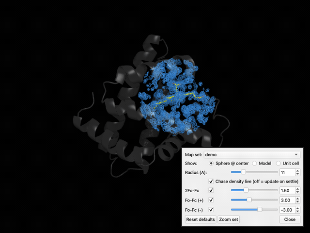
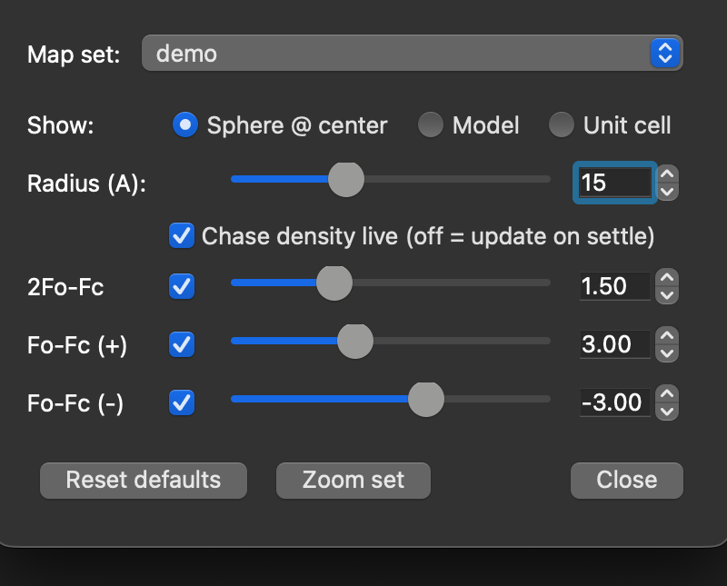

# pymol-automtz

**Coot-style `Auto Open MTZ...` for Incentive PyMOL.**

Drop in a `.mtz` and immediately get 2Fo-Fc and Fo-Fc electron-density maps at
sensible contour levels, drawn as new objects, with a live panel to dial σ — plus
a density sphere that follows the center of rotation.



*2Fo-Fc map (1.5 σ) for myoglobin at 1.2 Å (PDB ID **1BZ6**)*

Built on the `cmd.load_mtz` command of Incentive PyMOL, which reads the
MTZ, auto-detects columns, synthesizes σ-normalized map
objects (no CCP4/gemmi needed), and stores them as `<prefix>.2fofc` and
`<prefix>.fofc` objects. This plugin renders the mesh, the σ panel, the display
modes, and the File→Open routing.

## Requirements

- **Incentive PyMOL only** (tested on 3.1.6.1). The open-source PyMOL's
  `load_mtz` raises `IncentiveOnlyException`, so this plugin will not work there.
- The panel is built with **PyQt5** (`pymol.Qt`), which is what the Incentive GUI
  runs on (avoids Tkinter on MacOS.)

## Install

Copy or symlink `auto_mtz.py` into PyMOL's plugin startup directory, e.g.:

```
/Applications/PyMOL.app/Contents/lib/python3.10/site-packages/pmg_tk/startup/
```

then restart PyMOL. `__init_plugin__` registers the menu items and turns on
`.mtz` File→Open routing.

Or load it ad hoc for one session:

```
run /path/to/auto_mtz.py
auto_mtz your.mtz
sigma_panel
```

## Usage

```
auto_mtz filename [, prefix [, selection [, carve [, level_2fofc [, level_fofc ]]]]]
```

- Load a model first (optional) so the maps can carve around it.
- With File→Open routing on, simply opening a `.mtz` (menu, drag-drop, or the
  `pymol x.mtz` command line) runs `auto_mtz` automatically and opens the panel.

### Commands

| Command | Purpose |
|---|---|
| `auto_mtz` | Load an MTZ and draw 2Fo-Fc / Fo-Fc meshes |
| `sigma_panel` | Open the σ / display panel |
| `auto_mtz_route [on\|off]` | Toggle `.mtz` File→Open routing |
| `auto_mtz_keys [on\|off]` | Toggle keyboard σ stepping (see caveat) |

### The panel



- **Show:** three display modes for *where* density is drawn —
  - **Sphere @ center** *(default)* — a radius-R ball that **follows the center of
    rotation** (Coot-style). Radius slider (2–40 Å). A **Chase density live**
    checkbox toggles between continuous follow (default) and update-on-settle.
  - **Model** — carved around the loaded model (carve radius adjustable).
  - **Unit cell** — the whole synthesized map (one unit cell; in a space group
    with N symmetry operators this shows all N copies, not a single ASU — a true
    ASU wedge can't be clipped without gemmi/cctbx).
- **Per-map σ rows:** slider + spinbox + visibility toggle. **Scroll the mouse
  wheel over a spinbox/slider to contour** (0.02 σ steps), Coot-style.
- Reset defaults / Zoom buttons.

### Defaults

- 2Fo-Fc: **+1.5 σ** (blue)
- Fo-Fc: **+3.0 σ** (green) / **−3.0 σ** (red)

Maps are σ-normalized by `load_mtz`, so contour level == σ directly.

## Notes / caveats

- **Sphere follow** is implemented with a Qt poll timer (PyMOL fires no
  view-changed event) watching `get_view()`'s center of rotation. Each isomesh
  rebuild takes ~0.2 s on the main thread, so continuous "chase" updates a few
  times per second; "settle" mode recontours once you stop moving.
- **Keyboard σ shortcuts are unreliable on macOS.** The OS intercepts modified
  arrow keys (Mission Control, Spaces) and many function keys before PyMOL sees
  them, and PyMOL's `set_key` only accepts CTRL/ALT modifiers (not Command). Use
  the panel's mouse-wheel contouring instead. The `auto_mtz_keys` bindings
  (Alt-arrows) are kept for other platforms.

## License

MIT — see [LICENSE](LICENSE).
